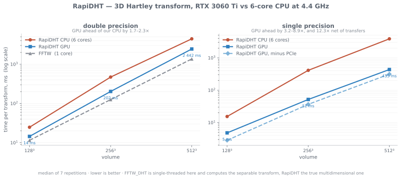

# Benchmarks

Everything below was measured on one machine: six cores at 4.4 GHz and an
RTX 3060 Ti (8 GiB), median of seven repetitions unless noted. Absolute numbers
say as much about that machine as about the library; the ratios are the point.

To reproduce, see [Running the benchmarks](#running-the-benchmarks) at the end.

---

## 3D volumes

This is what the library is for. `GPU` copies the volume across the bus on every
call, which is what the host-pointer overloads do; `Resident` keeps it on the
card through `DeviceVolume`.



| | CPU | GPU | Resident | vs CPU |
| --- | ---: | ---: | ---: | ---: |
| f32 128³ | 15 025 µs | 2 595 µs | **806 µs** | 18.6× |
| f32 256³ | 412 630 µs | 19 858 µs | **5 047 µs** | **81.8×** |
| f32 512³ | 3 815 926 µs | 177 130 µs | **58 117 µs** | **65.7×** |
| f64 128³ | 26 856 µs | 11 117 µs | 7 292 µs | 3.7× |
| f64 256³ | 476 088 µs | 136 434 µs | 107 829 µs | 4.4× |
| f64 512³ | 4 422 303 µs | 1 903 826 µs | 1 673 060 µs | 2.6× |

### The bus was hiding the transform

At 512³ the resident figure of 58.1 ms matches the 58.1 ms a profiler attributes
to the kernels, so nothing but the transform is being measured. Through the
copying interface the same work reads as 8.9× the CPU backend; resident, it is
65.7×.

The dense `cas` matrix is only `W × W` per axis and is reused once per line,
which turns the work into a batched GEMM — the case GPUs are built for — rather
than the memory-bound matrix-vector product that a single long 1D transform
degenerates into. The GEMMs reach 10.5 TFLOP/s against a 16.2 TFLOP/s peak.

### Precision decides the outcome on consumer hardware

A GeForce runs FP64 at a fraction of its FP32 rate, so single precision is 9–29×
faster on the device while barely moving the CPU. Anyone using this backend for
volumes should be in `float`. On datacentre cards the ratio is 1:2 rather than
1:64 and the choice matters far less.

### Only 3D is worth offloading

In 2D the GPU is roughly at parity. In 1D it is 66–80× slower: the axis is the
whole signal, so the matrix is `n × n`, and at n = 262 144 it would need 512 GiB.
The benchmark does not register GPU cases whose matrices exceed 1 GiB.

---

## Against cuFFT

cuFFT computes the Fourier transform, but for real input the Hartley transform
follows by one linear pass, `Re(X) − Im(X)`, so cuFFT plus an `O(N)` conversion
computes exactly what this library computes. That makes it the baseline that
matters.

At 512³ in single precision, both on data already resident on the device, both
measured in the same run:

| | time | arithmetic | achieved | extra device memory |
| --- | ---: | ---: | ---: | ---: |
| RapiDHT, matrix | 57.4 ms | 412 GFLOP | 7.2 TFLOP/s | **515 MiB** |
| cuFFT + conversion | **11.9 ms** | ~9 GFLOP | 0.76 TFLOP/s | 1 028 MiB |

**cuFFT is 4.8× faster on the transform.** That is the number to quote.

Two measured facts sit alongside it:

- The matrix path performs about **46× more arithmetic** yet finishes only 4.8×
  behind, because it is compute-bound and reaches 44% of the card while an FFT
  is bandwidth-bound and reaches around 5%.
- It needs **half the extra device memory** — 515 MiB of scratch and matrices
  against cuFFT's 1 028 MiB of spectrum and workspace, read from
  `cufftGetSize3d`. On this card that is a largest cubic volume of about 997³
  against about 871³.

The table settles neither of the two things that would decide the question. A
GEMM maps onto tensor cores and an FFT does not, so the gap is a property of the
card as much as of the algorithm. And the transform is one stage of a filtering
pipeline, where a Hartley spectrum multiplies an even kernel with a real
Hadamard product rather than a complex one.

### Extrapolating to other hardware

Spec-sheet arithmetic, not measurement, and it points somewhere uncomfortable.

| | FP32 | TF32 tensor | bandwidth | FLOP/byte |
| --- | ---: | ---: | ---: | ---: |
| RTX 3060 Ti | 16.2 T | 32.4 T | 448 GB/s | 36 |
| A100 | 19.5 T | 156 T | 1 555 GB/s | 13 |
| H100 | 67 T | 495 T | 3 350 GB/s | 20 |

A datacentre card adds bandwidth first, and bandwidth is what an FFT runs on.
Without tensor cores the gap at 512³ would widen from 4.8× to roughly 14×; with
TF32 tensor cores it would invert to roughly 2× in our favour. **Tensor cores are
not one optimisation among several — they are the condition for the approach
staying viable on newer hardware**, and they are something a GEMM can use and an
FFT fundamentally cannot.

---

## FFTW, for reference

`FFTW_DHT` in double takes 11 316 / 127 101 / 1 386 526 µs on the same volumes,
about 3× faster than this CPU backend.

Three caveats: FFTW here is single-threaded, it is in double against our float,
and in 2D/3D it computes the *separable* transform while RapiDHT computes the
true multidimensional one and pays for an extra Bracewell pass. The honest
reading is that a GPU beats a single CPU core, not that this beats FFTW.

---

## Known openings

- The CPU backend gains almost nothing from `float` — 1.15× where 2× is
  available — which points at butterflies that do not vectorise.
- Its throughput falls from 85 to 36 M points/s between 128³ and 256³, exactly
  where the volume stops fitting in the 18 MiB L3.
- 1024³ does not fit on an 8 GiB card in any precision: two buffers of 4 GiB
  each in `float`. Volumes beyond ~997³ need slab decomposition.

---

## Running the benchmarks

```bash
cmake -S . -B build-bench -DCMAKE_BUILD_TYPE=Release \
      -DRAPIDHT_BUILD_BENCHMARKS=ON -DRAPIDHT_WITH_CUDA=ON
cmake --build build-bench -j

export OMP_NUM_THREADS=6          # physical cores, not logical
./build-bench/benchmarks/bench_transform \
  --benchmark_repetitions=7 --benchmark_report_aggregates_only=true
```

Enabling benchmarks makes the configure step fetch Google Benchmark. An
`FFTW_DHT` baseline is built when FFTW is visible to `pkg-config`; the cuFFT
baseline is built whenever CUDA is on, and checks itself against this library's
own GPU path before reporting a number.

For a kernel-level breakdown:

```bash
./build-bench/benchmarks/profile_gpu3d 512 10 f32
nsys profile --stats=true ./build-bench/benchmarks/profile_gpu3d 512 10 f32
```
